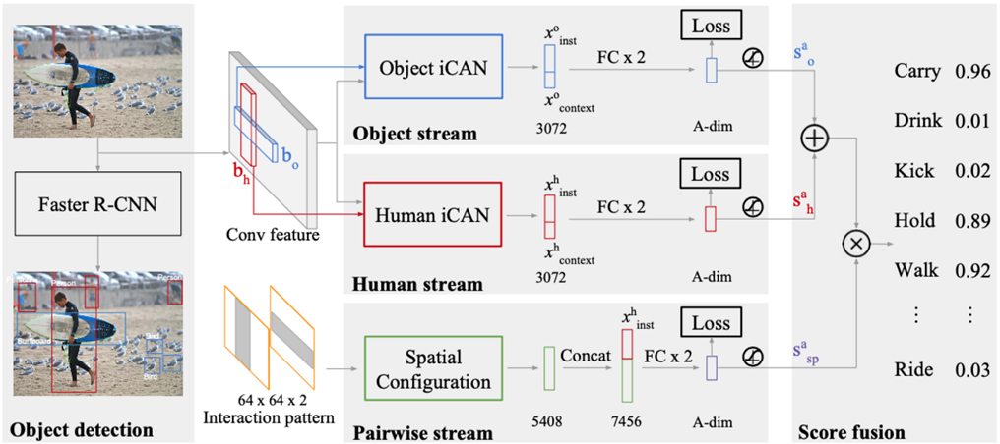
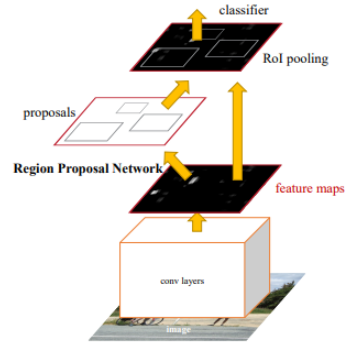
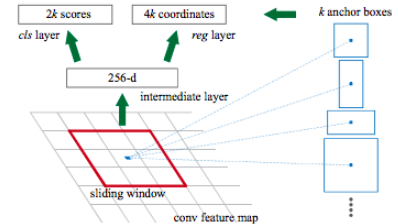
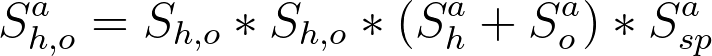
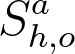
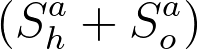
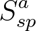
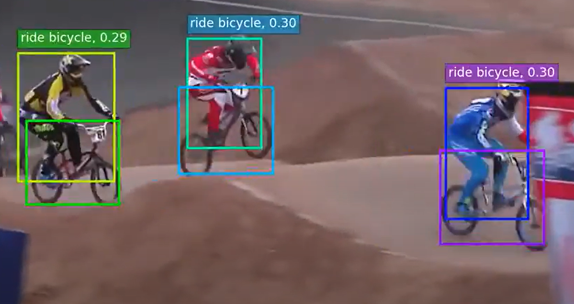

###### Chaiyeen Oh, Chanwoong Jhon

---
## Introduction

Artificial Intelligence is a fast growing field that gives impact on everyday lives. For instance, it automatically filters spam, recommends Netflix movies to watch and detect cancer from medical documentations. Also supplementary AI, such as the Internet of Things and virtual reality, is changing how people work in every industry. So for AI, working with humans, maintaining economic values, adapting to new environments and learning to work is significant.

 

## Problem

In the perspective of machines, technologies should keep humans at the center of the systems. In Computer Vision one of the common goal is to interpret images up to level that humans perceive. However, there are some limitations of machines visually recognizing descriptive phrases of human languages. For instance, if I were ordering a house robot to ‘grab a key on the table’, the robot would detect many keys correctly but don’t know which key I am specifically talking about.

  

 

We thought it came from the studies mostly focusing on object detection algorithms that fill up the image. However, the relationship between two or more objects has more significant meaning of the overall image. For example, even though all the images above have both a bicycle and a person, the interpretations for each image are different from each other due to its relationship between a person and a bicycle. Rather than using object detection in a single label, our team wanted to try to detect relationships between objects and generate how humans would describe the same image in subject, predicate, object format such as “person riding bicycle”.

 

## Motivation / Usage

 

 

Identifying visual relationship is important because it’s hard to interpret context of the image due to the complex structure of human language. And this problem hinder development of the computer vision of multi-modal AI in which multiple data sources such as image, text and speech are all combined to act like what humans do inside their brain.

With visual relationship detection model, images will also be more accurately retrieved since it provides important cues of identification. And this technology can be later used for searching images in local computer, website, and GIf search bar, detecting accidents in factory immediately, and generating description of videos that doesn’t have an audio for those who are blind.

 

## Current State Of Art

  

Human Pose Estimation         |   Secondary Regions
:----------------------------:|:-------------------------:
|  

 

Two examples that are used to predict visual relationship are human pose estimation and secondary region. When both approaches want to refer to an image as a person riding a horse, the first estimation will detect a person and extract features around human pose key points. And the second approach will find overlapping region or union of the human and object. While both approaches use hand-designed attention map that’s centered on individual cues of object or human. We instead used end-to-end trainable attention-based methods called instance-centric-attention-network (ICAN) to detect more contextual information of the image.

 

## Dataset

In this project, we used V-COCO as a dataset for this project. Verbs in COCO (V-COCO) is a dataset that builds off COCO for human-object interaction detection. Because we need to detect object with predicate or action verb, it was a perfect match for training the model.

V-COCO is consist of:
- 10,346 images
- 16,199 person instances
- Each person 
  -  29 action categories
  -  no interaction labels including objects

 

## Our Approach

In our approach, our pipeline can be splitted in three parts: 
1. Object Detection
2. Prediction: human centric, object, spatial configuration 
3. Score Confidence.

 

 

### 1. Object Detection

In this project, we used Faster R-CNN to detect object detection. 

Faster R-CNN model is composed of two modules:
Deep fully convolutional network and Fast R-CNN detector 

 

Regional Proposal Network            |     Fast R-CNN detector 
:-----------------------------------:|:-------------------------:
                      |  

 

The R-CNN is extracting the features based on a pre-trained convolutional neural network and classify the regional proposal to either the background or one of the object classes. With the R-CNN, we can detect the object fast. The RPN implements the terminology of neural network with attention to tell the object detection (Fast R-CNN) where to look.
The Regional Proposal Network(RPN) module is responsible for generating region proposals to detect. It applies the concept of attention in neural networks and it guides the Fast R-CNN detection module to where to look for objects in the image.
Fast R-CNN detector filters out the pre-computed image features to filter out the object candidates.
Both modules Regional Proposal Network and Fast R-CNN detector find the featured region first and drop the less probability scores on the region.

### 2. Prediction

Using instances from object detection, we generated the human object interaction hypothesis to compute action prediction scores. 

For human/object stream to detect its cues, we extracted the instance-level appearance feature for a person/object and contextual features based on the attentional map. And then we concatenated and pass it through two connected layers to produce the action scores. 

For pairwise stream, we took the union of two boxes and construct a binary image with two channels. And then, we extracted spatial features from this two-channel binary image by using CNN. Finally, to differentiate similar action prediction such as riding and walking a bicycle, we concatenated the spatial feature with human appearance feature.
 

### 3. Score Confidence

The Score Confidence is the calculation based on the correlation with the streams:
1. Score based on human/object appearance and contextual features (iCAN module)
2. Score based on the spatial relationship of human-object (Spatial Configuration)
3. The final prediction is calculated by combining the interaction prediction calculated from each stream

This inference can be implemented as an expression as follows:

 

 

On the expression:

 is the score for each action from the number of possible actions

 or  is the confidence for the individual object detections

 is the interaction prediction based on the appearance of the person sah and the object sao
 
 is  the score prediction based on the spatial relationship between the person and the object.
With calculation, the module detects the correlative scores in the human objective’s perspective.

 

## Conclusion

 
                      
|              |  |
|:---------------------------:|:-------------------------:|

As a result, we were able to highlight human and object interaction in colored boxes as shown above. As shown on the left image, box shows our model predicts multiple interactions with one person. On the right detection, our model predict more than one human interaction. This allow us to gather relevant contextual information facilitating human object interaction.

 

## Material

[View Presentation](presentation.pptx)

 

## References
V-COCO Dataset

Cewu Lu, Ranjay Krishna, Michael Bernstein, and Li Fei-Fei. Visual relationship detection with language priors. In ECCV, 2016.

Chen Gao and Yuliang Zou and Jia-Bin Huang. iCAN: Instance-Centric Attention Network for Human-Object Interaction Detection. In BMVC, 2018

Yash Goyal, Tejas Khot, Douglas Summers-Stay, Dhruv Batra, and Devi Parikh. Making the V in VQA Matter: Elevating the Role of Image Understanding in Visual Question Answering. Computer Vision and Pattern Recognition, 2017.

Ahmed Fawzy Gad. Faster R-CNN Explained for Object Detection Tasks. PaperspaceBlog, 2021
