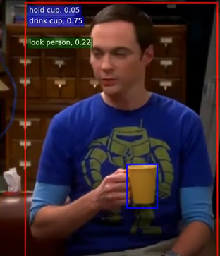

# cs639_vision_detection

## Problem
One of the common goal in Computer Vision is to interpret images up to level that humans perceive.

And many studies have done recognizing and understanding the object that mostly fill up the image,
However, the relationship between two or more objects has more significant meaning of the overall image.

For instance, even all the images above have both bicycle and a person, the interpretations for each images are different from each other due to its relationship between a person and a bicycle.

## Motivation Important?
Identifying visual relationship is important because it’s hard to interpret context of the image due to the complex structure of human language

And this problem hinder development of the computer vision of multi-modal AI in which multiple data sources such as image, text and speech are all combined to act like what humans do inside their brain

With visual relationship detection model, images will also be more accurately retrieved since it provides important cues of identification 

And this technology can be later used for 
searching images in local computer, website, and GIf search bar 
detecting accidents in factory immediately 
and generating description of videos that doesn’t have an audio for those who are blind

:-------------------------:|:-------------------------:
  |  

Xxx such as visually similar image but modified in small ways.

## Current State Of Art

Two examples that are used to predict visual relationship are human pose estimation and secondary region. 

When both approaches want to refer to an image as a person riding a horse,

Human Pose estimation will first detect a person, and extract features around human pose key points 
but second approach will find overlapping region or union of the human and object

While both approaches use hand-designed attention map that’s centered on individual cues of object or human, 

we instead used end-to-end trainable attention-based methods called instance-centric-attention-network to detect more contextual information of the image.

## Our Approach 
Our  instance centric attention network approaches to human-object interaction in three parts: detecting objects, construct prediction with human’s, object’s, spatial configuration perspective, and generating score confidence.
First, in order to detect human, R-CNN is used as selective search to localize people and object instances in the picture. Given the detected instances, our method aims to recognize interactions between all pairs of objects including human.
After searching our object detection, the model with CNN calculates the prediction of spatial relationship between human and objects for the next step called score fusion.

At the end of our approach,, computing the interaction confidence, we score the values by the above following equation. We compute the most closely related output with the score which depends on the confidence for the individual object detections. for each human-object interaction, we need to predict the Human object Interface score for each action A, where A denotes the total number of possible actions.
Through our approach, we can get the result with highlighting the detected human and object interaction in colored boxes.
On the left side,, our box shows our model can predict multiple situations in the given data, which means our model can detect different actions and objects in one human object.
On the right side, our model can predict more than one human box.
It represents our model can detect two or more interaction with their objects respectively.
This allow us to gather relevant contextual information facilitating Human Object Interaction.
With our project, the unexpected situations can be alerted and prevented.
Eventually, we can get the support in human’s activity cared by the supportive devices. 

For the terminology,
S a h o is the score for each action from the number of possible actions
S h or S o is the confidence for the individual object detections
s a h + s a o is the interaction prediction based on the appearance of the person sah and the object sao
sasp is  the score prediction based on the spatial relationship between the person and the object.
With calculation, the module detects the correlative scores in the human objective’s perspective.

## Results and comparison

For the terminology,
S a h o is the score for each action from the number of possible actions
S h or S o is the confidence for the individual object detections
s a h + s a o is the interaction prediction based on the appearance of the person sah and the object sao
sasp is  the score prediction based on the spatial relationship between the person and the object.
With calculation, the module detects the correlative scores in the human objective’s perspective.

## Discussion 
-what did you learn from this project?
-where could this lead to in the future? 

## Reference

